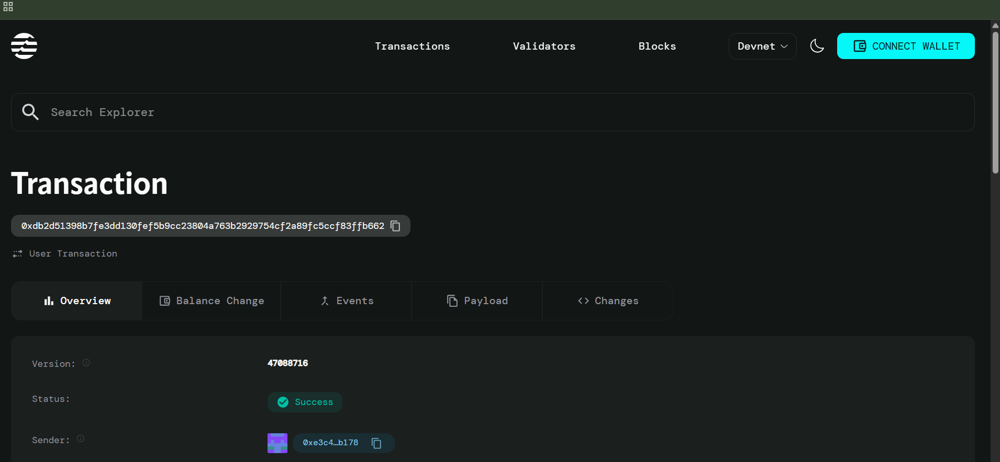

# Batch Transaction Executor

## Project Description
Build efficient batch transaction processing system on the Aptos blockchain that enables users to execute multiple token transfers in a single transaction call. This smart contract optimizes gas costs and improves transaction throughput by bundling multiple individual transactions into one atomic operation, making it ideal for applications requiring mass payouts, airdrops, or bulk transfers.

## Project Vision
To revolutionize blockchain transaction efficiency by providing a robust, gas-optimized solution for batch processing multiple transactions. Our vision is to eliminate the inefficiencies of individual transaction processing and create a seamless experience for users who need to perform bulk operations on the Aptos blockchain.

## Key Features

### ✨ Core Functionality
- **Batch Transaction Processing**: Execute multiple token transfers in a single transaction
- **Gas Optimization**: Reduce transaction costs by bundling operations
- **Atomic Operations**: All transactions in a batch succeed or fail together
- **Flexible Recipients**: Send different amounts to multiple recipients simultaneously

### 🔧 Technical Features
- **Transaction Tracking**: Monitor total transactions processed and amounts transferred
- **Active State Management**: Enable/disable batch processing functionality
- **Vector-based Input**: Accept arrays of recipients and amounts for batch processing
- **Error Handling**: Built-in validation for input consistency and account states

### 🛡️ Security Features
- **Input Validation**: Ensures recipient and amount arrays have matching lengths
- **State Verification**: Confirms batch executor is active before processing
- **Atomic Execution**: Maintains transaction integrity across all batch operations

## Future Scope

### 🚀 Enhanced Features
- **Multi-Token Support**: Extend beyond AptosCoin to support various token types
- **Scheduling System**: Implement time-based batch execution
- **Permission Management**: Add role-based access control for enterprise use
- **Gas Estimation**: Pre-calculate transaction costs for better planning

### 📊 Analytics & Monitoring
- **Transaction Analytics**: Detailed reporting and statistics dashboard
- **Performance Metrics**: Monitor batch sizes, success rates, and optimization gains
- **Event Logging**: Comprehensive audit trail for all batch operations

### 🔗 Integration Capabilities
- **API Gateway**: RESTful API for external application integration
- **Webhook Support**: Real-time notifications for batch completion
- **SDK Development**: Client libraries for popular programming languages
- **DeFi Integration**: Connect with decentralized finance protocols

### 🌐 Scalability Improvements
- **Layer 2 Integration**: Optimize for high-throughput environments
- **Cross-chain Compatibility**: Extend functionality to other blockchain networks
- **Parallel Processing**: Implement concurrent batch execution for massive scale operations

## Contract Details
0xdb2d51398b7fe3dd130fef5b9cc23804a763b2929754cf2a89fc5ccf83ffb662



## Getting Started

### Prerequisites
- Aptos CLI installed
- Move compiler setup
- Sufficient AptosCoin balance for transaction fees

### Deployment
```bash
aptos move compile
aptos move publish
```

### Usage
1. Initialize the batch executor for your account
2. Prepare vectors of recipient addresses and amounts
3. Execute batch transactions with a single function call

## Contributing
Contributions are welcome! Please read our contributing guidelines and submit pull requests for any improvements.

## License
This project is licensed under the MIT License - see the LICENSE file for details.